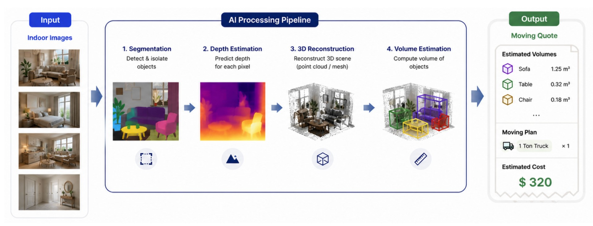
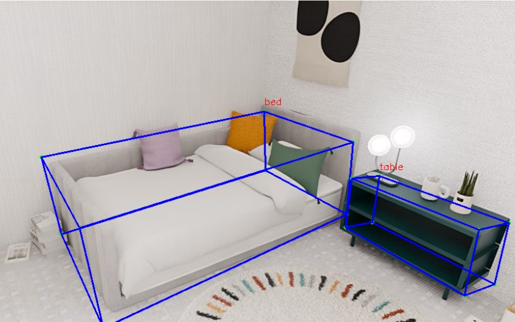
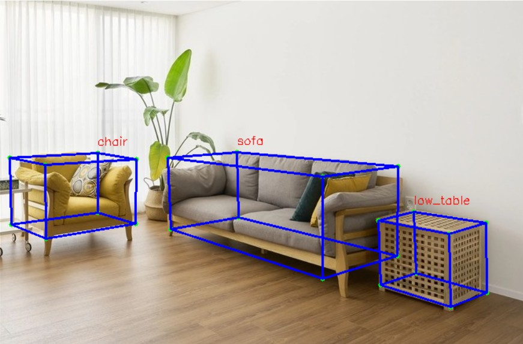

<div align="center">

# Noble Logistics — AI Moving Estimate Demo

A web demo that measures the 3D volume of furniture from a single room photo and produces a moving estimate (recommended truck tonnage, crew size, and cost).
Built on the [LabelAny3D](https://uva-computer-vision-lab.github.io/LabelAny3D/) single-image 3D reconstruction pipeline.

</div>

## 1. Environment

```bash
pip install -r requirements.txt
```

GPU environment definitions: [envs/labelany3d.yml](envs/labelany3d.yml), [envs/sam.yml](envs/sam.yml)
Setup and external dependencies: [docs/INSTALL.md](docs/INSTALL.md)

## 2. Pipeline

<p align="center">
  
</p>

[run_single_full_pipeline_parallel.sh](run_single_full_pipeline_parallel.sh) runs 7 stages with partial parallelism:

```
[1] Segmentation (SAM3)            ← sequential (everything depends on it)
      │
      ├─ [2] Depth estimation ─────────────────┐
      └─ [3] Object cropping → [4] Amodal       │  run in parallel
                              → [5] Elevation   │
      ─────────────────────────────────────────┘  wait for all
[6] 3D reconstruction (Amodal3R)   ← sequential
[7] Scene layout alignment         ← sequential
```

- **[1] Segmentation**: SAM3 generates instance masks from indoor-furniture keyword prompts (chair, desk, sofa, refrigerator, etc.)
- **[2] Depth / [3] Cropping**: depth estimation and object cropping run in parallel
- **[4] Amodal completion / [5] Elevation**: run in parallel on the crops
- **[6] 3D reconstruction**: reconstructs a 3D mesh from `_rgba.png`
- **[7] Alignment**: aligns individual objects into one scene coordinate frame, producing `3dbbox.json`

Finally, [src/calc_volume.py](src/calc_volume.py) sums the volume of each 3D bounding box in `3dbbox.json`.

## 3. Performance

Predicted truck tonnage vs. ground truth (GT):

| House | GT Truck Size (ton) | Model Predicted (ton) |
|-------|:-------------------:|:---------------------:|
| house_005 | 1 | 1 |
| house_010 | 3 ~ 4 | 4 |
| house_016 | 2 | 2 |

3D bounding box reconstruction results:

<p align="center">
  
  
</p>

## 4. Usage

### Web demo

```bash
cd web_demo
pip install -r requirements.txt
uvicorn app:app --host 0.0.0.0 --port 8000
```

Open `http://localhost:8000` → upload a room photo → enter moving details (floor, elevator, distance) → get the estimate.

The web demo supports **interactive segmentation**: when automatic segmentation is inaccurate, you can add, exclude, or edit instances by clicking before running the pipeline (`start → click/tap/select → commit`).

### Standalone server run

```bash
bash run_single_full_pipeline_parallel.sh /abs/path/image.jpg
```

> ⚠️ The standalone server run has **no instance-exclusion (interactive selection) feature.** Every furniture instance detected by SAM3 is included in 3D reconstruction and volume computation as-is. To exclude specific objects, use the web demo's interactive segmentation.

Key environment variables:

| Variable | Default | Description |
|----------|---------|-------------|
| `GPU_IDX` | `0` | GPU index to use |
| `OBJ_REC` | `amodal3r` | 3D reconstruction backend |
| `MIN_MASK_AREA` | `800` | Minimum mask area (px) filter |
| `SAM3_PROMPTS` | indoor-furniture default list | Segmentation prompts (comma-separated) |
| `SAM3_CONF` | `0.5` | SAM3 confidence threshold |
| `SKIP_SEG` | `0` | If `1`, reuse an existing segmentation JSON (`SEG_JSON`) |
| `SAM_PYTHON` | `/opt/conda/envs/sam/bin/python` | Python interpreter for SAM3 |

Results are saved under `experimental_results/single/val/<scene>/`; per-stage timings in `timing.txt`, final boxes in `3dbbox.json`.

## 5. Citation (LabelAny3D)

This demo is built on the single-image 3D reconstruction pipeline from [LabelAny3D](https://uva-computer-vision-lab.github.io/LabelAny3D/). If you use it in your research, please cite:

```BibTeX
@inproceedings{yao2025labelany3d,
  title={LabelAny3D: Label Any Object 3D in the Wild},
  author={Jin Yao and Radowan Mahmud Redoy and Sebastian Elbaum and Matthew B. Dwyer and Zezhou Cheng},
  booktitle={Neural Information Processing Systems (NeurIPS)},
  year={2025}
}
```

- Project page: https://uva-computer-vision-lab.github.io/LabelAny3D/
- Paper: https://openreview.net/pdf?id=Q2fU0JDHuW
- Code: https://github.com/UVA-Computer-Vision-Lab/LabelAny3D
